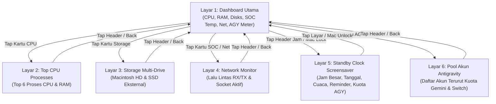

# ESP32-S3 Mac System Monitor (PC Hardware & AI Assistant HUD)

Sistem hardware monitoring desktop real-time mandiri (*Desk HUD Monitor*) untuk macOS berbasis board pengembang **Waveshare ESP32-S3-Touch-LCD-4.3"** (layar 800×480 RGB Parallel TFT, driver ST7262, 8MB Octal PSRAM, dan 16MB Flash).

Proyek ini menampilkan telemetri beban kerja CPU, temperatur inti (CPU/GPU), penggunaan RAM, kapasitas storage dual-drive, lalu lintas bandwidth jaringan, widget cuaca dinamis, reminder harian, hingga indikator **Antigravity AI Assistant Cockpit** dengan antarmuka grafis modern bergaya *Dark Cyberpunk*. Dilengkapi pula dengan dukungan layar sentuh interaktif untuk berpindah antarmuka dan mengganti akun Google aktif secara instan tanpa membuka GUI desktop.

---

## 1. Tumpukan Teknologi & Komponen (Tech Stack)

| Kategori | Teknologi / Pustaka | Keterangan |
| :--- | :--- | :--- |
| **Microcontroller** | ESP32-S3-WROOM-1-N16R8 | Dual-Core Xtensa LX7 @ 240 MHz, 16MB Flash, 8MB Octal PSRAM |
| **Display Panel** | Waveshare 4.3" TFT LCD (800×480) | 16-bit Parallel RGB (5-6-5), PCLK 16 MHz, ST7262 Driver IC |
| **I/O Expander** | CH422G (I2C Bus `0x24`) | Mengontrol Backlight LCD, Reset LCD, dan Reset Touchscreen |
| **Touchscreen** | Goodix GT911 (I2C Bus `0x5D` / `0x14`) | Multitouch kapasitif interaktif untuk navigasi kartu dan switch akun |
| **GUI Framework** | LVGL v8.3.11 | Render grafis berbasis widget arc, bar, label, dan palet warna kustom |
| **JSON Parser** | ArduinoJson v7.4.3 | Zero-allocation deserialization untuk parsing telemetri tanpa heap bloat |
| **Firmware Framework**| Arduino Core ESP32 (v2.0.17 / ESP-IDF 4.4 backend) | Manajemen clock, FreeRTOS multitask, dan antarmuka USB Serial/JTAG |
| **Build System** | PlatformIO Core | Toolchain otomasi build, partisi custom 16MB, dan flashing firmware |
| **Host Bridge** | Python 3 via PM2 (`esp32hud`) | Daemon pengumpul metrik macOS via `psutil`, `powermetrics`, `sysctl`, & Google API |

---

## 2. Struktur Direktori & Arsitektur Modul

```text
Esp32HudMonitorPC/
├── platformio.ini                  # Konfigurasi board, OPI PSRAM, QIO Flash 80MHz, optimasi -O2
├── default_16MB.csv                # Skema partisi Flash 16MB (App 6.25MB, SPIFFS 9.6MB)
├── requirements.txt                # Dependensi pustaka Python host (pyserial, psutil, cryptography)
├── .gitignore                      # Filter berkas artefak build (.pio, .venv, pycache)
├── README.md                       # Dokumentasi utama & catatan pembelajaran teknis
├── docs/
│   ├── ESP32S3_RGB_TEARING_POSTMORTEM.md          # Analisis mendalam eliminasi glitch/tearing ST7262
│   └── ANTIGRAVITY_ACCOUNT_SWITCH_ARCHITECTURE.md # Arsitektur autentikasi & switch akun AGY via HUD
├── include/
│   ├── board_config.h              # Definisi pinout ST7262 RGB, I2C CH422G, dan GT911
│   └── lv_conf.h                   # Konfigurasi engine grafis LVGL & custom font montserrat
├── src/
│   ├── main.cpp                    # Entry point firmware, loop LVGL, dan parser serial CDC
│   ├── hardware/
│   │   ├── ch422g.h / .cpp         # Driver kontroler CH422G IO expander via I2C
│   │   └── display.h / .cpp        # Inisialisasi panel RGB ST7262 & SRAM double buffer LVGL
│   ├── ui/
│   │   ├── ui_mac_monitor.h / .cpp # Dashboard Mac Monitor Cyberpunk & Screen Coordinator
│   │   ├── ui_screen_agy_cockpit.h / .cpp # Layar Pool Akun AGY & Switch Event Handler (SRP)
│   │   ├── ui_theme.h              # Token warna cyberpunk dan helper UI bersama
│   │   └── ui_avatar.h / .cpp      # Template UI avatar robotik pendamping terminal
│   └── network/
│       └── wifi_manager.h / .cpp   # Modul opsional komunikasi nirkabel (Wi-Fi/WebSockets)
└── tools/
    ├── mac_monitor_bridge.py       # Daemon pengumpul telemetri, background quota refresher, & serial bridge
    └── agy_bridge.py               # Daemon alternatif integrasi voice recognition Antigravity CLI
```

### Rincian Peran Tiap Berkas Kunci
- **[`platformio.ini`](platformio.ini)**: Menentukan arsitektur memori `qio_opi` (Quad Flash + Octal PSRAM) dan frekuensi 80 MHz, alokasi partisi 16MB, optimasi `-O2`, serta dependensi pustaka.
- **[`include/board_config.h`](include/board_config.h)**: Berisi pemetaan 16 pin data RGB (D0–D15), sinyal sinkronisasi (HSYNC, VSYNC, DE, PCLK), alamat I2C CH422G (`0x24`), dan alamat Touch GT911 (`0x5D` / `0x14`).
- **[`src/hardware/display.cpp`](src/hardware/display.cpp)**: 
  - Mengonfigurasi kontroler RGB panel ESP32-S3 dengan timing ST7262 resmi (PCLK 16 MHz, HBP=88, HPW=48, HFP=40, VBP=32, VPW=3, VFP=13).
  - Mengalokasikan **dua draw buffer parsial** masing-masing 40 baris langsung di SRAM internal berkecepatan tinggi (`MALLOC_CAP_INTERNAL | MALLOC_CAP_DMA`) untuk menghindari bus contention.
  - Menempatkan fungsi flush [`my_disp_flush`](src/hardware/display.cpp) di dalam **IRAM** menggunakan `IRAM_ATTR`.
- **[`src/ui/ui_mac_monitor.cpp`](src/ui/ui_mac_monitor.cpp)**: Merancang antarmuka dashboard Cyberpunk:
  - 1 Top Header (Nama Chip SoC, IP Lokal, dan Jam/Uptime sistem).
  - 3 Kartu Atas (CPU Arc Gauge, RAM Arc Gauge, SSD Capacity Bar).
  - 2 Kartu Bawah:
    - Kiri: SOC Thermal Sensors CPU/GPU & Network Download/Upload Traffic.
    - Kanan: **AGY Active Meter** (Dua circular arc meter untuk kuota 5 Jam & Mingguan model Gemini dan Claude/GPT serta label akun aktif dinamis).
  - Mengimplementasikan logika *differential update* (hanya memperbarui widget yang nilainya berubah) untuk menekan beban render CPU.
- **[`src/ui/ui_screen_agy_cockpit.cpp`](src/ui/ui_screen_agy_cockpit.cpp)**: Layar sekunder terisolasi (Modular Screen) untuk menampilkan daftar seluruh akun Antigravity Cockpit (terurut descending berdasarkan kuota Gemini terbanyak) dan menangani gesture touch switch akun secara langsung.
- **[`src/main.cpp`](src/main.cpp)**: Mengontrol siklus FreeRTOS loop:
  - Menerima baris JSON melalui USB Serial CDC buffer.
  - Mengekstrak data metrik ke dalam struct fixed-size char tanpa alokasi heap dinamis (`String`).
  - Mengirim respons konfirmasi `ACK:OK` ke PC.
  - Memanggil `lv_timer_handler()` untuk menyegarkan tampilan.
- **[`tools/mac_monitor_bridge.py`](tools/mac_monitor_bridge.py)**: Skrip Python multi-threaded yang berjalan di Mac via PM2 (`esp32hud`):
  - Mengumpulkan beban CPU (`psutil.cpu_percent`), memori fisik, sisa kapasitas storage (`shutil.disk_usage`), dan delta kecepatan bandwidth jaringan.
  - Mengekstrak temperatur CPU/GPU Apple Silicon secara akurat via `powermetrics` / `sysctl`.
  - **Standalone Quota Refresher**: Background worker asinkron setiap 60 detik yang memeriksa dan memperbarui sisa kuota seluruh akun Antigravity via Google Cloud Code Internal API tanpa perlu membuka desktop GUI Cockpit Tools.
  - Mengirim payload JSON setiap 1.0 detik ke port USB ESP32 (`/dev/cu.usbmodem*`) dan memverifikasi balasan `ACK:OK`.

---

## 3. Fitur Utama & Navigasi Layar Sentuh (Touch Interactions)

Layar Waveshare 4.3" mendukung gesture sentuh (*tap*) pada kartu-kartu dashboard untuk membuka detail telemetri:



### Rincian Antarmuka:
1. **Layar 1 (Dashboard Utama)**:
   - **Header Atas**: Nama Chip SoC (Apple M4), Jam digital, IP Lokal (`en1`), dan Uptime.
   - **3 Kartu Atas**: CPU Gauge Arc, RAM Usage Arc, dan Dual Storage Bar.
   - **Kartu Bawah Kiri**: Sensor Suhu SoC (CPU & GPU) berdampingan dengan ringkasan bandwidth jaringan (KB/s atau MB/s).
   - **Kartu Bawah Kanan (AGY Active Meter)**: Indikator akun AI aktif dengan 2 Circular Arc Meter (Gemini 5h di kiri, Claude/GPT 5h di kanan, lengkap dengan persentase mingguan di bawahnya).
2. **Layar 2 (Top Processes)**: Menampilkan 6 proses konsumsi CPU tertinggi beserta PID dan persentase RAM.
3. **Layar 3 (Storage Multi-Drive)**: Memantau status partisi internal (`Macintosh HD`) dan drive eksternal (`MAC_EXTERNAL_SSD` / SD Card) secara terpisah.
4. **Layar 4 (Network Monitor)**: Grafik tingkat transfer RX/TX, total sesi terunduh/terunggah, dan daftar soket koneksi aplikasi aktif.
5. **Layar 5 (Screensaver Standby - Apple Watch Style)**: Jam digital besar dengan status cuaca, carousel Apple Reminders harian, dan bar sisa kuota AGY aktif.
6. **Layar 6 (Pool Akun Antigravity Cockpit)**: Menampilkan daftar seluruh akun Google Cockpit terurut berdasarkan kuota Gemini terbanyak. Pengguna dapat langsung **menekan baris akun untuk melakukan switch akun secara headless**.

---

## 4. Temuan Penting & Catatan Teknis (Knowledge Base)

Bagian ini merangkum temuan dan solusi dari berbagai kendala operasional untuk menjadi referensi bagi pengembang dan AI agent berikutnya:

### A. Auto-Refresh Kuota AGY Tanpa GUI Desktop (Headless 60s Worker)
- **Problem**: Angka kuota akun AI sebelumnya hanya diperbarui saat pengguna membuka aplikasi GUI Cockpit Tools dan menekan refresh.
- **Solution**: Daemon `tools/mac_monitor_bridge.py` kini menjalankan background thread asinkron setiap **60 detik**:
  1. Mendekripsi token akun dari storage `~/.antigravity_cockpit/accounts/<id>.json` menggunakan master key `secure-account-storage.key` (AES-256-GCM).
  2. Jika token mendekati kedaluwarsa (`< 300 detik`), worker otomatis memanggil endpoint OAuth Google untuk memperbarui `access_token` via `refresh_token`, lalu mengenkripsi dan menyimpannya kembali ke file akun.
  3. Memanggil API internal `POST https://daily-cloudcode-pa.googleapis.com/v1internal:retrieveUserQuotaSummary` dengan payload `{}`.
  4. Hasil sisa kuota langsung ditulis ke file cache resmi Cockpit (`~/.antigravity_cockpit/cache/quota_api_v1_desktop/authorized/<sha256(email)>.json`).
- **Security Guardrail**: Agar tidak memicu pencegahan commit GitHub Push Protection, kredensial Google OAuth Client ID & Secret diekstrak secara dinamis saat runtime dari binary lokal Cockpit Tools (`strings "/Applications/Cockpit Tools.app/Contents/MacOS/cockpit-tools"`), sehingga tidak ada kredensial sensitif yang tersimpan secara statis di repository.

### B. Stabilisasi Transisi Screensaver Standby (Anti-Flicker Hysteresis)
- **Problem**: Layar jam screensaver sempat mengalami kedap-kedip (berganti-ganti layar sendiri) saat Mac dalam keadaan idle tetapi layar masih menyala.
- **Root Cause**: Sebelumnya kode menggunakan kondisi `m.gpu_temp <= 0.0f` sebagai sinyal tidur monitor. Pada SoC Apple Silicon M4, saat idle beban grafis sangat rendah sehingga pembacaan sensor sesekali mengembalikan nilai 0.
- **Solution**:
  1. Pemicu transisi dikunci **hanya** pada parameter murni `m.display_off` (yang dideteksi di host Mac melalui CoreGraphics API `CGDisplayIsAsleep` dan dictionary `CGSessionCopyCurrentDictionary`).
  2. Menambahkan filter histeresis 2 siklus pembacaan (`ss_counter >= 2`) di firmware ESP32 untuk mencegah *false positive* sesaat.

### C. Mekanisme Switch Akun Antigravity Headless
- **Problem**: Memanggil WebSocket Cockpit Tools tidak berpengaruh pada Antigravity Standalone karena aplikasi membaca kredensial langsung dari **macOS Keychain**.
- **Solution**: Prosedur 5 tahap terintegrasi yang dijalankan langsung oleh bridge saat menerima sinyal serial `CMD:SWITCH_AGY:<id>`:
  1. Update metadata akun aktif di `accounts.json` & `antigravity_legacy_instances.json`.
  2. Dekripsi token envelope akun terpilih (AES-256-GCM).
  3. Injeksi token ke macOS Keychain (`security add-generic-password -U -s gemini -a antigravity ...`) dengan format base64 Go-Keyring, serta perbarui token cache `jetski-standalone-oauth-token`.
  4. Update Protobuf `userStatus` di SQLite database `state.vscdb`.
  5. Kirim perintah term/relaunch proses Antigravity secara bersih.
  *(Detail lengkap di [`docs/ANTIGRAVITY_ACCOUNT_SWITCH_ARCHITECTURE.md`](docs/ANTIGRAVITY_ACCOUNT_SWITCH_ARCHITECTURE.md))*

### D. Solusi Port Locking saat Flashing Serial Firmware
- **Problem**: Perintah `pio run -t upload` sering gagal dengan pesan `Resource busy` atau `could not open port /dev/cu.usbmodem*`.
- **Root Cause**: Port serial CDC sedang dibuka dan di-lock secara eksklusif oleh proses daemon PM2 `esp32hud` (`mac_monitor_bridge.py`).
- **SOP Flashing Firmware**:
  ```bash
  # 1. Matikan daemon bridge untuk melepas lock port serial
  pm2 stop esp32hud

  # 2. Lakukan kompilasi dan upload firmware
  pio run -t upload

  # 3. Nyalakan kembali daemon bridge setelah upload sukses
  pm2 start esp32hud
  ```

### E. Pencegahan Glitch / Tearing Layar Parallel RGB
- **Problem**: Glitch garis horizontal pada layar ST7262 saat data serial tiba.
- **Root Cause**: DMA FIFO starvation pada kontroler RGB akibat perebutan bus PSRAM internal saat buffer serial dibaca bersamaan.
- **Solution**: Alokasi double buffer LVGL langsung di **internal SRAM** (`MALLOC_CAP_INTERNAL | MALLOC_CAP_DMA`), penempatan fungsi flush di **IRAM** (`IRAM_ATTR`), serta penerapan *differential rendering* pada LVGL widget.
  *(Detail lengkap di [`docs/ESP32S3_RGB_TEARING_POSTMORTEM.md`](docs/ESP32S3_RGB_TEARING_POSTMORTEM.md))*

---

## 5. Protokol Komunikasi Serial Dua Arah

Komunikasi antara Mac dan ESP32-S3 berjalan melalui USB Serial CDC pada baudrate `115200`.

### A. Mac ke ESP32 (Telemetri JSON Berkala Setiap 1 Detik)
Format data baris JSON (diakhiri `\n`):
```json
{
  "cpu": 24.5,
  "cpu_temp": 64.2,
  "gpu_temp": 61.0,
  "ram_pct": 71.4,
  "ram_used": 11.4,
  "ram_total": 16.0,
  "disk_pct": 58.4,
  "disk_free": 185.3,
  "net_down": 1250.4,
  "net_up": 142.8,
  "rx_gb": 14.52,
  "tx_gb": 3.12,
  "iface": "en1",
  "ip": "192.168.1.15",
  "chip": "Apple M4",
  "uptime": "15h 12m",
  "time": "15:05",
  "date": "Sabtu, 12 September 2026",
  "day_idx": 5,
  "disp_off": 0,
  "rem": "Meeting Evaluasi • Beli Kebutuhan Toko",
  "w_temp": 31.0,
  "w_code": 1,
  "w_day": 1,
  "w_text": "Cerah Berawan",
  "w_loc": "Bekasi",
  "procs": [{"n": "Google Chrome", "p": 1245, "c": 14.2, "m": 8.1}],
  "conns": [{"n": "node", "p": 5421, "r": "142.250.185.206:443", "s": "ESTAB"}],
  "disks": [
    {"name": "Macintosh HD", "pct": 58.4, "used": 260.1, "free": 185.3, "total": 445.4, "type": "INTERNAL"},
    {"name": "MAC_EXTERNAL_SSD", "pct": 42.1, "used": 405.0, "free": 550.2, "total": 955.2, "type": "EXTERNAL"}
  ],
  "agy": {
    "acc": "coklattembok5",
    "c_5h": 92, "c_wk": 88,
    "g_5h": 98, "g_wk": 95,
    "ready": 7, "total": 7,
    "list": [
      {"id": "uuid-1", "n": "coklattembok5", "cur": 1, "c_5h": 92, "c_wk": 88, "g_5h": 98, "g_wk": 95}
    ]
  }
}
```

### B. ESP32 ke Mac (Handshake & Perintah Interaktif Touch)
- **Handshake Telemetri Sukses**:
  ```text
  ACK:OK\n
  ```
- **Perintah Ganti Akun AI dari Layar Sentuh**:
  ```text
  CMD:SWITCH_AGY:<account_uuid>\n
  ```

---

## 6. Panduan Instalasi & Menjalankan Sistem

### A. Persiapan Perangkat Keras
1. Board **Waveshare ESP32-S3-Touch-LCD-4.3"**.
2. Kabel USB Type-C High-Speed Data terhubung ke port Mac.

### B. Flash Firmware ke ESP32
```bash
cd /Users/echoaxis/Projects/Esp32/Esp32HudMonitorPC

# 1. Hentikan bridge jika sedang berjalan
pm2 stop esp32hud

# 2. Flash firmware via PlatformIO
pio run -t upload

# 3. Jalankan kembali service telemetri
pm2 start esp32hud
```

### C. Manajemen Daemon Host di Mac (PM2)
Bridge Python dikelola secara otomatis menggunakan PM2 agar berjalan di background saat Mac menyala:
```bash
# Cek status runtime daemon
pm2 status esp32hud

# Melihat log transmisi dan handshake secara real-time
pm2 logs esp32hud --lines 30

# Restart daemon manual
pm2 restart esp32hud
```

---

## 7. Lisensi & Kredit

- **Hardware Manufacturer**: [Waveshare ESP32-S3-Touch-LCD-4.3 Wiki](https://www.waveshare.com/wiki/ESP32-S3-Touch-LCD-4.3)
- **GUI Engine**: [LVGL v8.3.11](https://lvgl.io/)
- **Author / Developer**: echoaxis
