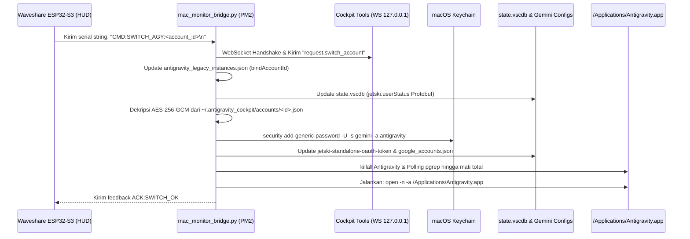

# Dokumentasi Arsitektur Autentikasi & Mekanisme Switch Akun Antigravity (HUD ESP32-S3)

## Ringkasan Eksekutif
Dokumen ini merinci temuan teknis mengenai bagaimana sistem beralih akun Google pada aplikasi **Antigravity (Standalone / Legacy GUI)** secara otomatis ketika pengguna menyentuh salah satu baris akun pada layar Waveshare 4.3" ESP32-S3 HUD.

Tantangan utama yang terpecahkan:
1. Memanggil endpoint WebSocket Cockpit Tools (`request.switch_account`) **tidak cukup** untuk mengganti sesi Antigravity Standalone karena aplikasi membaca kredensial langsung dari **macOS Keychain**, bukan dari Cockpit daemon.
2. Token autentikasi di Cockpit disimpan dalam format terenkripsi (**AES-256-GCM**).
3. Diperlukan orkestrasi 5 langkah terpadu: Dekripsi token envelope Cockpit, injeksi ke macOS Keychain, pembaruan file fallback JSON Gemini, sinkronisasi Protobuf `userStatus` di SQLite `state.vscdb`, dan restart proses Antigravity secara bersih.

---

## 1. Arsitektur Komponen & Lokasi File

| Komponen | Jalur File / Layanan | Peran / Deskripsi |
| :--- | :--- | :--- |
| **Kunci Enkripsi Master** | `~/.antigravity_cockpit/secure-account-storage.key` | Kunci simetris 256-bit (Base64) untuk mendekripsi akun di Cockpit. |
| **Penyimpanan Akun Cockpit** | `~/.antigravity_cockpit/accounts/<account_id>.json` | Envelope terenkripsi (`nonce`, `ciphertext`) berisi Google OAuth token. |
| **Daftar Akun Cockpit** | `~/.antigravity_cockpit/accounts.json` | Metadata akun publik (`id`, `email`, `name`, `current_account_id`). |
| **Instansi Legacy Antigravity** | `~/.antigravity_cockpit/antigravity_legacy_instances.json` | Mapping binding akun aktif (`defaultSettings.bindAccountId`). |
| **macOS Keychain** | Service: `gemini`, Account: `antigravity` | **Sumber kebenaran tunggal (*Single Source of Truth*)** untuk autentikasi binary Go `language_server` Antigravity Standalone. |
| **Gemini Fallback Cache** | `~/.gemini/jetski-standalone-oauth-token` & `~/.gemini/google_accounts.json` | Konfigurasi token lokal yang dibaca saat Keychain dingin (*cold start*). |
| **Antigravity State DB** | `~/Library/Application Support/Antigravity/User/globalStorage/state.vscdb` | SQLite database Electron/VSCode berisi status pengguna (`jetski.userStatus`). |
| **Aplikasi Antigravity** | `/Applications/Antigravity.app` | Aplikasi GUI desktop berbasis Electron + Go `language_server`. |
| **Serial Bridge Daemon** | `tools/mac_monitor_bridge.py` | Daemon Python yang dijalankan via PM2 (`esp32hud`). Mengelola komunikasi serial dua arah dengan ESP32-S3. |

---

## 2. Struktur Data & Mekanisme Kriptografi

### A. Dekripsi Token dari Cockpit Tools
Setiap akun di `~/.antigravity_cockpit/accounts/<account_id>.json` dibungkus dalam format:
```json
{
  "nonce": "<base64_encoded_12_bytes>",
  "ciphertext": "<base64_encoded_payload_with_tag>"
}
```

Dekripsi dilakukan menggunakan algoritma **AES-256-GCM**:
```python
from cryptography.hazmat.primitives.ciphers.aead import AESGCM
import base64, json

key = base64.b64decode(open("~/.antigravity_cockpit/secure-account-storage.key").read().strip())
aesgcm = AESGCM(key)

nonce = base64.b64decode(envelope["nonce"])
ciphertext = base64.b64decode(envelope["ciphertext"])
decrypted_data = json.loads(aesgcm.decrypt(nonce, ciphertext, None))
```

Payload hasil dekripsi berisi objek `token`:
- `access_token`: Token akses bearer Google.
- `refresh_token`: Refresh token Google OAuth2.
- `expiry_timestamp`: Waktu kedaluwarsa Unix timestamp.
- `email`: Alamat email akun.

---

### B. Format Payload macOS Keychain (`gemini / antigravity`)
Binary Go `language_server` Antigravity membaca Keychain dengan format spesifik yang diproduksi oleh library `go-keyring`.
- **Service**: `gemini`
- **Account**: `antigravity`
- **Format Nilai Sandi**: Diawali dengan prefix string `go-keyring-base64:` diikuti JSON yang di-encode ke Base64:

```json
{
  "token": {
    "access_token": "ya29.a0...",
    "token_type": "Bearer",
    "refresh_token": "1//0g...",
    "expiry": "2026-09-11T00:05:30.000000Z"
  },
  "auth_method": "consumer"
}
```

Perintah CLI injeksi ke Keychain:
```bash
security add-generic-password -U -s "gemini" -a "antigravity" -w "go-keyring-base64:<BASE64_PAYLOAD>"
```

---

### C. Sinkronisasi Protobuf `jetski.userStatus` (`state.vscdb`)
Tabel `ItemTable` pada SQLite `~/Library/Application Support/Antigravity/User/globalStorage/state.vscdb` menyimpan key `jetski.userStatus` berupa serialisasi biner Protobuf.
Jika nilai ini tidak disesuaikan atau dihapus, UI Electron terkadang masih me-render avatar/nama pengguna sebelumnya sebelum token disegarkan.

Format field protobuf yang di-encode:
- Field 1 (Varint): `email_status`
- Field 2 (Varint): `email_tier`
- Field 3 (Length-delimited string): `user_tier`
- Field 4 (Length-delimited string): `account_email`
- Field 5 (Length-delimited string): `account_id`

---

## 3. Alur Kerja Lengkap Pergantian Akun (Step-by-Step Flow)

Ketika pengguna menekan baris akun di panel Antigravity pada layar ESP32-S3:



---

## 4. Penanganan Masalah & Catatan Kritis (Gotchas)

### 1. PM2 Menjalankan Versi Kode Lama dalam Memori
- **Gejala**: Kode pada `mac_monitor_bridge.py` telah diperbarui, tetapi log terminal PM2 tidak mencerminkan perubahan atau tidak menjalankan fungsi injeksi Keychain.
- **Penyebab**: PM2 menjalankan proses Python sebagai daemon persisten di latar belakang.
- **Solusi**: Setiap kali ada perubahan pada file bridge, wajib jalankan:
  ```bash
  pm2 restart esp32hud
  ```

### 2. Antigravity Menutup tapi Tidak Membuka Kembali (Zombie Window / File Lock)
- **Gejala**: Aplikasi Antigravity tertutup saat switch akun, tetapi tidak terbuka kembali.
- **Penyebab**: Pemanggilan `open -a` dilakukan terlalu cepat setelah `killall Antigravity`. Proses `language_server` dan Electron membutuhkan waktu hingga 1-1.5 detik untuk melepas lock file di `~/Library/Application Support/Antigravity`.
- **Solusi**: 
  - Gunakan loop polling `pgrep -x Antigravity` dengan timeout sebelum mengeksekusi peluncuran ulang.
  - Tambahkan flag `-n` (`open -n -a /Applications/Antigravity.app`) agar macOS memaksa membuka instance baru tanpa tergantung pada state instance lama.

### 3. Integritas Virtual Environment Python
- Daemon PM2 menggunakan interpreter virtualenv:
  `/Users/echoaxis/Projects/Esp32/Esp32HudMonitorPC/.venv/bin/python3`
- Library `cryptography` terpasang di venv ini. Jika script dijalankan dengan global Python tanpa virtualenv, import `from cryptography.hazmat...` akan menghasilkan `ModuleNotFoundError`.

### 4. Modularitas UI LVGL (Prinsip Clean Code & SRP)
- Halaman AGY Cockpit dipecah menjadi modul independen di `src/ui/ui_screen_agy_cockpit.h` dan `ui_screen_agy_cockpit.cpp`.
- Token warna dan helper pembuatan kartu diisolasi pada `src/ui/ui_theme.h`.
- Koordinator utama `UIMacMonitor` mendelegasikan inisialisasi dan update metrik tanpa intervensi state internal AGY.

### 5. Algoritma Pengurutan Akun (Gemini Quota Descending)
- Pada `tools/mac_monitor_bridge.py`, daftar akun diurutkan sebelum dikirim ke ESP32 agar akun dengan kapasitas kuota terbanyak selalu muncul di baris teratas HUD:
  ```python
  acc_list.sort(key=lambda x: (x['g_5h'], x['g_wk'], x['c_5h']), reverse=True)
  ```
- Prioritas sorting:
  1. Kuota **Gemini 5-Hour** (`g_5h` descending).
  2. Kuota **Gemini Weekly** (`g_wk` descending).
  3. Kuota **Claude 5-Hour** (`c_5h` descending).

### 6. Operasi Switch Akun Bersifat Mandiri (Headless / Tanpa GUI Cockpit)
- **Tidak Bergantung pada Cockpit Tools.app**: Switch akun tetap berjalan 100% sukses meskipun aplikasi GUI `Cockpit Tools.app` sedang ditutup.
- Daemon `mac_monitor_bridge.py` memperbarui `current_account_id` langsung di berkas konfigurasi `~/.antigravity_cockpit/accounts.json` dan menginjeksi token yang didekripsi langsung ke macOS Keychain serta konfigurasi Gemini.
- Percobaan koneksi WebSocket ke Cockpit daemon bersifat *graceful/optional* (tidak memblokir jalannya proses injeksi jika terjadi error `Connection refused`).

### 7. Perilaku Penyegaran Cache Kuota (Quota Cache Behavior)
- **Sumber Angka Kuota**: Angka kuota (5h/Wk) dibaca dari file cache JSON di `~/.antigravity_cockpit/cache/quota_api_v1_desktop/authorized/*.json`.
- **Keterbatasan Saat Cockpit Mati**: Pembaruan isi file cache ini ke server Google dilakukan oleh aplikasi Cockpit Tools. Jika aplikasi Cockpit tidak pernah dibuka sama sekali dalam durasi yang panjang, angka kuota yang tampil di HUD akan menampilkan nilai terakhir yang tersimpan di cache lokal. Membuka GUI Cockpit sesekali diperlukan jika ingin menyegarkan snapshot angka kuota terbaru.

### 8. Isolasi Biner & Proses: Antigravity Standalone vs Antigravity IDE
- **Temuan Kritis Sistem**:
  Pada sistem macOS pengguna, terdapat dua aplikasi Antigravity yang berbeda:
  1. `/Applications/Antigravity.app` (**Antigravity Standalone**, bundle ID: `com.google.antigravity`, proses: `Antigravity`).
  2. `/Applications/Antigravity IDE.app` (**Antigravity IDE** berbasis VS Code/Electron, bundle ID: `com.google.antigravity-ide`, proses: `Electron`).
- **Masalah Jika Menggunakan `killall Antigravity`**:
  Perintah bawaan `killall Antigravity` atau `pgrep -x Antigravity` dapat salah sasaran atau hanya memicu sinyal pada salah satu aplikasi (seringkali yang ter-restart hanya *Antigravity IDE* sementara *Antigravity Standalone* beserta Go `language_server` tetap berjalan dengan memegang token sesi lama di memori).
- **Solusi Baku (Standard Solution)**:
  - Gunakan inspeksi `psutil` berbasis path eksekusi (`exe` & `cmdline`):
    - Deteksi `/Applications/Antigravity.app` untuk proses Standalone.
    - Deteksi `/Applications/Antigravity IDE.app` untuk proses IDE.
  - Sinkronisasi kedua SQLite state database:
    - `~/Library/Application Support/Antigravity/User/globalStorage/state.vscdb`
    - `~/Library/Application Support/Antigravity IDE/User/globalStorage/state.vscdb`
  - Perbarui token embedded (`antigravityUnifiedStateSync.oauthToken` dan `userStatus`) di kedua database.
  - **Prinsip Peluncuran Ulang Kondisional (*Conditional Relaunch Only*)**:
    - Sistem hanya mengeksekusi `open -n -a` untuk aplikasi yang **sebelumnya benar-benar sedang dibuka/aktif (memiliki jendela GUI)**.
    - Jika salah satu aplikasi sedang ditutup/mati saat pengguna melakukan switch akun, sistem **TIDAK AKAN** meluncurkannya secara tiba-tiba. Token Keychain dan konfigurasi lokal tetap diperbarui di latar belakang, sehingga ketika pengguna kelak membuka aplikasi tersebut, akun yang digunakan sudah otomatis sesuai.

---

## 5. Implementasi Kode Referensi

Fungsi utama pada `tools/mac_monitor_bridge.py`:

```python
def inject_account_to_keychain(target_account_id):
    """Mendekripsi envelope akun dari Cockpit dan menginjeksi token ke macOS Keychain & Gemini configs."""
    key_path = os.path.expanduser('~/.antigravity_cockpit/secure-account-storage.key')
    env_path = os.path.expanduser(f'~/.antigravity_cockpit/accounts/{target_account_id}.json')
    if not os.path.exists(key_path) or not os.path.exists(env_path):
        return False
    try:
        from cryptography.hazmat.primitives.ciphers.aead import AESGCM
        from datetime import datetime, timezone
        import base64

        with open(key_path) as f:
            key = base64.b64decode(f.read().strip())

        with open(env_path) as f:
            envelope = json.load(f)

        nonce = base64.b64decode(envelope['nonce'])
        ciphertext = base64.b64decode(envelope['ciphertext'])
        aesgcm = AESGCM(key)
        data = json.loads(aesgcm.decrypt(nonce, ciphertext, None))

        tok = data.get('token', {})
        target_email = data.get('email', '')
        if not tok.get('access_token'):
            return False

        expiry_ts = tok.get('expiry_timestamp', int(time.time() + 3600))
        expiry_dt = datetime.fromtimestamp(expiry_ts, tz=timezone.utc)
        expiry_str = expiry_dt.strftime("%Y-%m-%dT%H:%M:%S.000000Z")

        keyring_payload = {
            "token": {
                "access_token": tok["access_token"],
                "token_type": tok.get("token_type", "Bearer"),
                "refresh_token": tok.get("refresh_token", ""),
                "expiry": expiry_str
            },
            "auth_method": "consumer"
        }

        # 1. Update macOS Keychain (gemini / antigravity)
        encoded_blob = "go-keyring-base64:" + base64.b64encode(json.dumps(keyring_payload).encode()).decode()
        subprocess.check_call([
            "security", "add-generic-password",
            "-U",
            "-s", "gemini",
            "-a", "antigravity",
            "-w", encoded_blob
        ])

        # 2. Update ~/.gemini/jetski-standalone-oauth-token
        jetski_path = os.path.expanduser('~/.gemini/jetski-standalone-oauth-token')
        with open(jetski_path, 'w') as f:
            json.dump(keyring_payload, f, indent=2)

        # 3. Update ~/.gemini/google_accounts.json
        gacc_path = os.path.expanduser('~/.gemini/google_accounts.json')
        with open(gacc_path, 'w') as f:
            json.dump({"active": target_email, "old": []}, f, indent=2)

        return True
    except Exception as e:
        print(f"[SWITCH ERROR] Failed to inject token: {e}")
        return False
```

---

## 5. Standalone Background Quota Refresher (Headless 60s Interval)

Untuk menghilangkan ketergantungan pada aplikasi GUI Cockpit Tools desktop saat memeriksa sisa kuota, daemon `mac_monitor_bridge.py` dilengkapi dengan worker asinkron mandiri:

1. **Frekuensi & Pola Thread**:
   - Berjalan pada background thread terpisah setiap **60 detik**.
   - Tidak memblokir loop utama streaming telemetri hardware ke ESP32.
2. **Auto-Refresh Google OAuth Token**:
   - Memeriksa batas kedaluwarsa token (`expiry_timestamp`). Jika sisa waktu `< 300 detik` (5 menit), worker otomatis memperbarui `access_token` via endpoint `https://oauth2.googleapis.com/token` menggunakan `refresh_token`.
   - Token baru dienkripsi kembali menggunakan AES-256-GCM dengan nonce acak 12-byte baru dan disimpan ke envelope `~/.antigravity_cockpit/accounts/<id>.json`.
3. **Penyegaran Kuota Langsung (Direct Internal API)**:
   - Mengirim request `POST https://daily-cloudcode-pa.googleapis.com/v1internal:retrieveUserQuotaSummary` dengan header otentikasi Bearer dan payload `{}` kosong.
   - Hasil kuota (Gemini 5h/weekly & Claude/GPT 5h/weekly) langsung diperbarui ke berkas cache `~/.antigravity_cockpit/cache/quota_api_v1_desktop/authorized/<sha256(email)>.json`.
4. **Keamanan Kredensial (Secret Protection)**:
   - Nilai Google OAuth Client ID & Secret diekstrak secara dinamis saat runtime dari binary lokal Cockpit Tools (`/Applications/Cockpit Tools.app/Contents/MacOS/cockpit-tools`), sehingga tidak ada string kredensial sensitif yang tersimpan secara eksplisit di repositori git.

